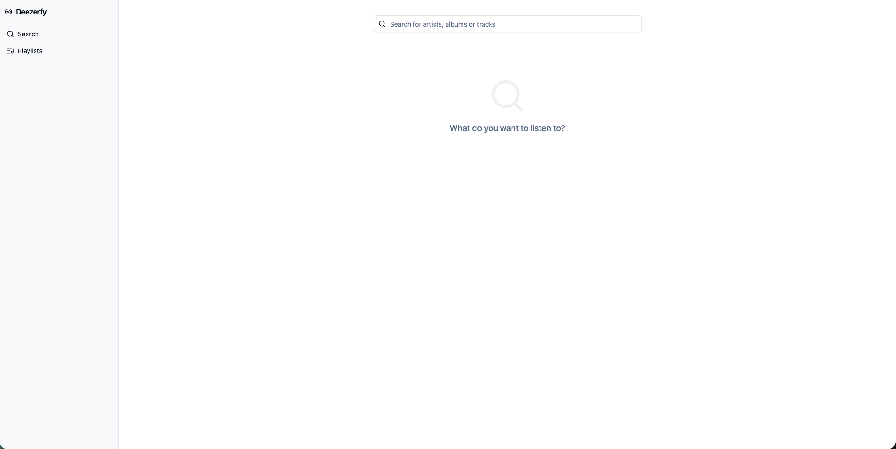
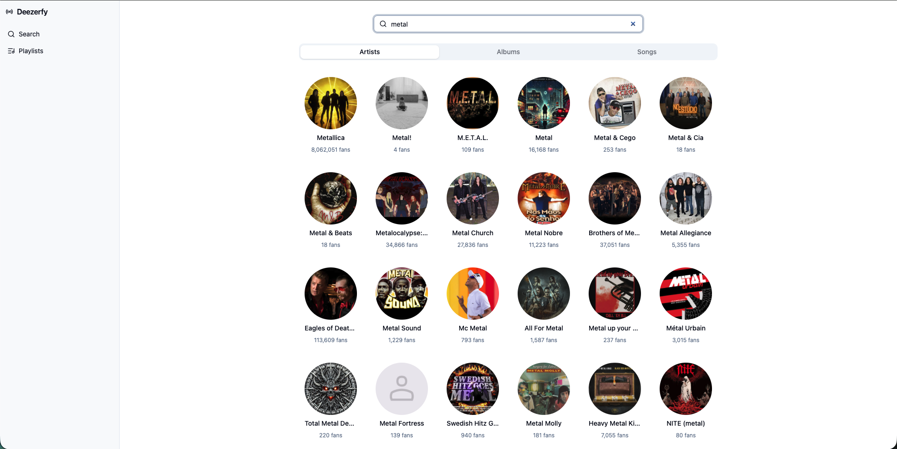
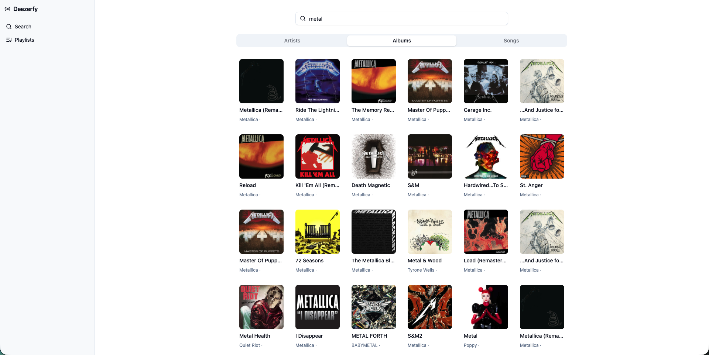
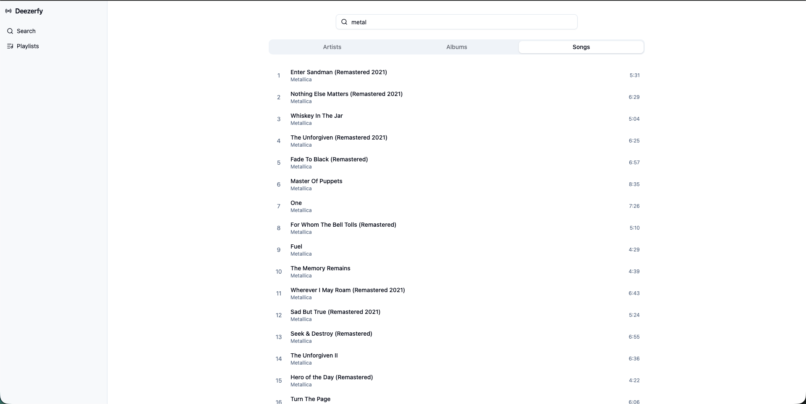
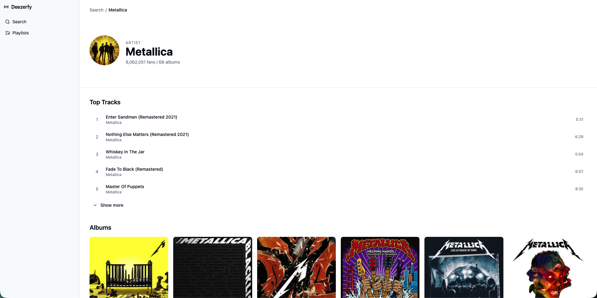
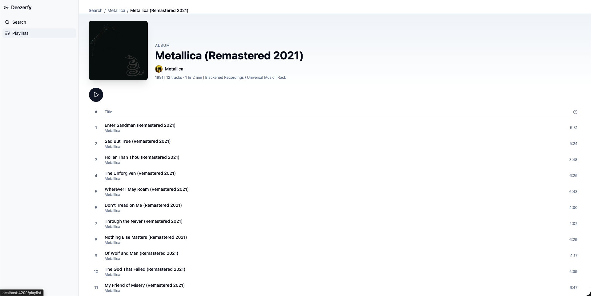
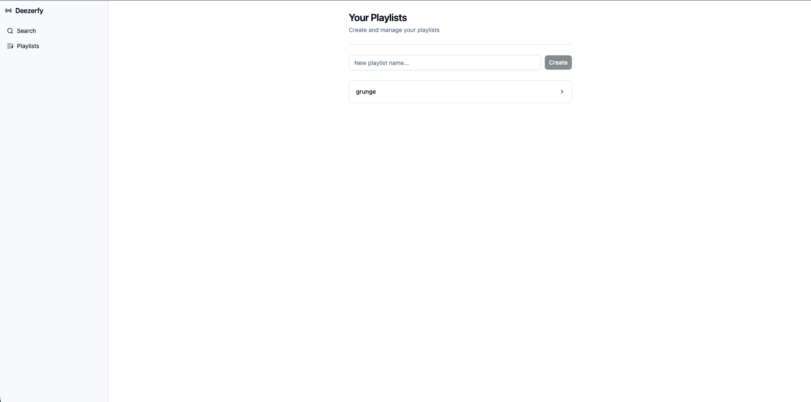
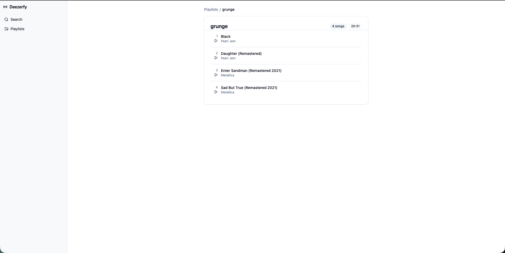

# Deezerfy

Deezerfy is a Deezer clone which utilizes the free Deezer API to search for artists, albums and songs. The user can add and remove songs from a playlist which they may also rename or delete. The playlists are stored in IndexDB.

## Prerequisites

- Node 22
- Angular 21

## Setup

```bash
git clone https://github.com/Graduate-Program-26/angular-assessment-troy.git
cd angular-assessment-troy
npm install
npm start
```

Navigate to `http://localhost:4200`

## Tech stack

- Angular 21: standalone components, signals-first state, new control flow
- NgRx Signals: `signalStore` for playlist state
- spartan/ui: headless component primitives
- Tailwind CSS v4
- idb: IndexedDB wrapper for playlist storage

## Screenshots

Search Page


Artist Search


Album Search


Song Search


Artist Page


Album Page


Playlist Creator


Playlist Details


## Known limitations

- No artist biography text

- No OAuth Login
